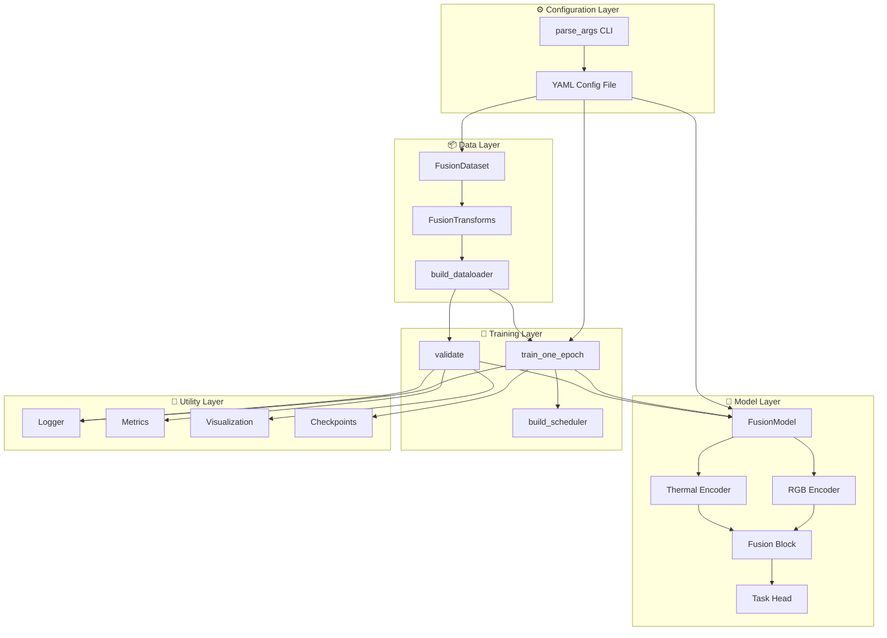
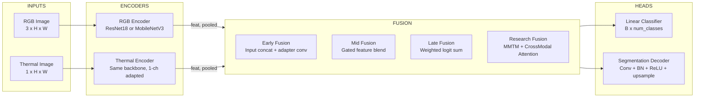
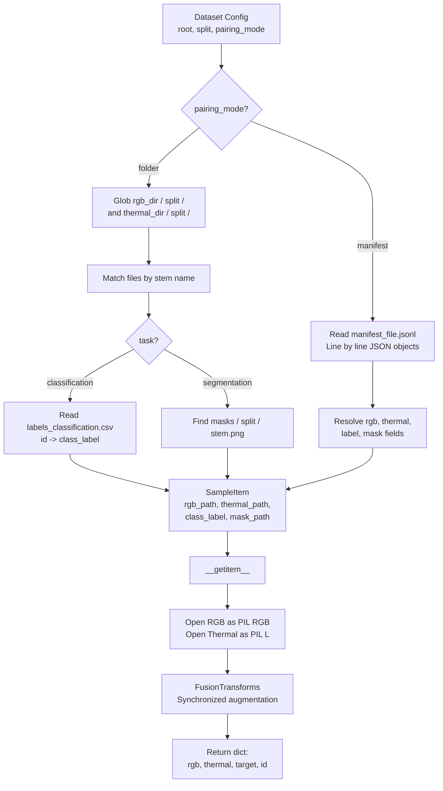
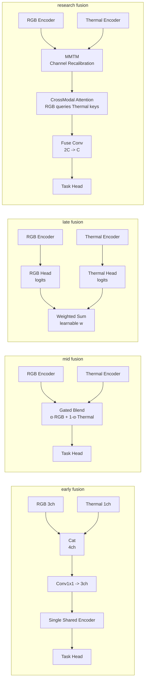
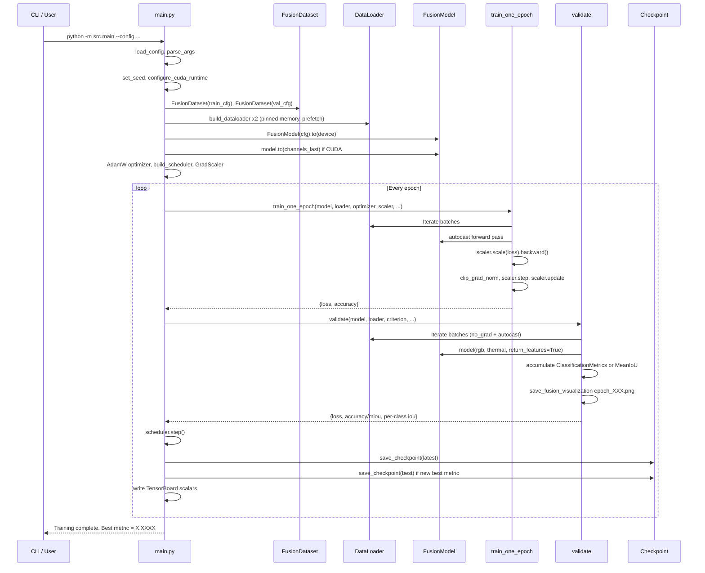
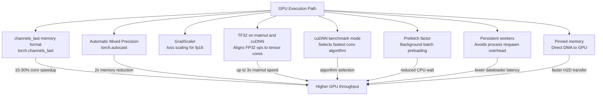
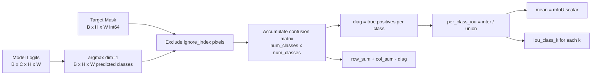
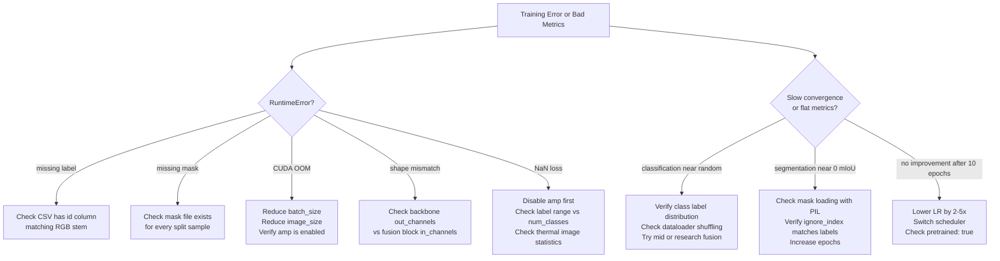

# RGB-T Fusion

[](https://www.python.org/)
[](https://pytorch.org/)
[](https://developer.nvidia.com/cuda-toolkit)
[](LICENSE)
[](https://github.com/hkevin01/rgbt-fusion/commits/main)
[](https://github.com/hkevin01/rgbt-fusion/issues)


---

RGB-T Fusion is a **GPU-optimized, research-grade multimodal machine learning framework** that trains deep neural networks on paired visible-spectrum (RGB) and thermal infrared (T) image data. The project targets the full spectrum from quick classification baselines to state-of-the-art cross-modal attention fusion for semantic segmentation, all driven by a single YAML configuration file.

The design philosophy is simple: changing a single `fusion_strategy` field in a config file should be enough to switch between four fundamentally different fusion architectures without touching any Python code. This allows controlled ablation studies, rapid hypothesis testing, and reproducible experiment management that would otherwise require maintaining four separate codebases.

> [!IMPORTANT]
> This repository is a fully runnable research baseline. Every component — from data loading through model construction through training and evaluation — is wired together and GPU-accelerated out of the box. You can be training within minutes of cloning.

---

## Table of Contents

- [Why RGB-T Fusion](#why-rgb-t-fusion)
- [Tech Stack Deep Dive](#tech-stack-deep-dive)
- [System Architecture](#system-architecture)
- [Model Architecture](#model-architecture)
- [Data Pipeline](#data-pipeline)
- [Fusion Strategies](#fusion-strategies)
- [Training Lifecycle](#training-lifecycle)
- [GPU Optimization](#gpu-optimization)
- [Configuration Reference](#configuration-reference)
- [Experiment Profiles](#experiment-profiles)
- [Metrics and Evaluation](#metrics-and-evaluation)
- [Runbook](#runbook)
- [Output Artifacts](#output-artifacts)
- [Troubleshooting](#troubleshooting)
- [Roadmap](#roadmap)
- [API Reference](#api-reference)
- [Repository Layout](#repository-layout)

---

## Why RGB-T Fusion

RGB cameras are the workhorse of computer vision. They produce rich, high-resolution images that work extremely well in controlled lighting. However, they are fundamentally limited by the physics of visible light: they fail in darkness, degrade in fog and rain, and are confused by glare and shadows. These failure modes are precisely the conditions that matter most in autonomous vehicles, security surveillance, search-and-rescue robotics, and industrial inspection.

Thermal infrared cameras do not depend on visible light at all. They detect heat emitted by objects, which means they remain effective in complete darkness, through light fog, and in high-glare environments where RGB cameras would be blinded. The tradeoff is that thermal images lack fine texture, color, and the high-frequency detail that makes RGB imagery so powerful for recognition tasks.

**RGB-T fusion exploits the complementary strengths of both modalities simultaneously.** A fused model can use thermal data to detect the presence and rough shape of objects in difficult conditions, while using RGB data to discriminate fine-grained categories and textures when lighting permits. The result is a perception system that is more robust across a wider range of conditions than either modality alone.

The challenge is not simply concatenating the inputs. The optimal point at which to combine information — and the mechanism used to combine it — significantly affects model capacity, training stability, and generalization. This project makes those design choices explicit, configurable, and comparable.

> [!TIP]
> If you are new to RGB-T fusion, start with `configs/segmentation_mid.yaml`. Mid-level fusion with MobileNetV3 is a strong, fast baseline that works well across a wide variety of aligned RGB-T datasets without heavy tuning.

---

## Tech Stack Deep Dive

Every library in this stack was chosen for a specific purpose. Understanding why each dependency exists helps you make informed decisions when extending or adapting the framework.

**PyTorch (`torch >= 2.2`)** is the core computation engine. It provides the automatic differentiation system, the neural network module hierarchy, CUDA tensor operations, and the Automatic Mixed Precision (AMP) infrastructure that this project depends on. PyTorch 2.2 specifically introduced stability improvements to `torch.compile` and better support for `bfloat16` on Ampere and Hopper GPUs, which are both relevant to this framework.

**torchvision (`>= 0.17`)** supplies pretrained backbone weights (ResNet-18 via `ResNet18_Weights.DEFAULT`, MobileNetV3-Small via `MobileNet_V3_Small_Weights.DEFAULT`) and functional image transformation utilities. Using pretrained weights is critical for fast convergence on small and medium-sized RGB-T datasets where training from scratch would require far more data.

**Pillow (`>= 10.0`)** handles all image I/O. It provides a unified API for loading JPEGs, PNGs, and single-channel thermal images regardless of file format. The dataset class uses PIL exclusively for loading before handing off to torchvision functional transforms.

**NumPy (`>= 1.24`)** is used for random seed management, segmentation mask array conversion, and visualization normalization. It acts as the bridge between PIL image arrays and PyTorch tensors.

**PyYAML (`>= 6.0`)** parses the YAML configuration files that define every experiment. The config system is deliberately simple — a plain dictionary loaded from disk — which means configs can be version-controlled, diffed, and understood without any special tooling.

**tqdm (`>= 4.66`)** provides per-batch progress bars in the training and validation loops. This is important in practice because it gives real-time feedback on throughput, loss values, and estimated time remaining without any changes to the core loop logic.

**matplotlib (`>= 3.8`)** powers the per-epoch visualization output. After each validation pass the framework saves a four-panel figure showing the input RGB image, the thermal image, the mean activation of the fused feature map, and the model prediction. These images are invaluable for catching data loading bugs and model failure modes early.

**TensorBoard (`>= 2.16`)** receives scalar summaries for training loss, validation loss, accuracy or mIoU, and learning rate at every epoch. The TensorBoard integration is optional and controlled by a config flag, so it adds no overhead when disabled.

**opencv-python (`>= 4.8`)** is available as a dependency for any extension work requiring more advanced image processing, morphological operations, or optical flow computation that goes beyond what PIL and torchvision offer.

| # | Package | Version | Role in Framework | Critical Feature Used |
|---|---------|---------|-------------------|----------------------|
| 1 | torch | >=2.2.0 | Core ML engine | Autograd, CUDA ops, AMP, DataLoader |
| 2 | torchvision | >=0.17.0 | Backbones + transforms | Pretrained weights, TF.resize, TF.normalize |
| 3 | numpy | >=1.24.0 | Array bridge + seeding | Mask array conversion, RNG seeding |
| 4 | pillow | >=10.0.0 | Image I/O | Multi-format loading, RGB/L conversion |
| 5 | PyYAML | >=6.0 | Config parsing | safe_load for experiment YAML files |
| 6 | tqdm | >=4.66.0 | Progress feedback | Per-batch progress with dynamic postfix |
| 7 | matplotlib | >=3.8.0 | Visualization | Four-panel epoch visualization output |
| 8 | tensorboard | >=2.16.0 | Scalar logging | SummaryWriter for loss/metric traces |
| 9 | opencv-python | >=4.8.0 | Extension support | Available for custom preprocessing |

> [!NOTE]
> All packages in `requirements.txt` have minimum versions pinned to avoid silent behavior changes from upstream updates. The `environment.yml` additionally pins the CUDA toolkit version through the `nvidia` conda channel to ensure GPU driver compatibility.

---

## System Architecture

The system is organized into five discrete layers that communicate through well-defined interfaces. No layer reaches into the internals of another, which means you can replace the data layer without touching the model layer, or swap the fusion module without rewriting the training loop.



> [!NOTE]
> Every arrow in this diagram corresponds to a real function call or data dependency in the codebase. The layered design means each component can be tested, replaced, or extended independently.

The **Configuration Layer** is the entry point for every experiment. `parse_args()` reads the CLI flags (`--config`, `--resume`, `--eval-only`, `--checkpoint`, `--device`) and `load_config()` parses the YAML file into a plain Python dictionary that flows through the entire system. Every hyperparameter, path, and behavioral flag lives in that dictionary.

The **Data Layer** owns all I/O. `FusionDataset` builds the list of paired sample paths at construction time through either folder scanning or JSONL manifest reading, then `FusionTransforms` applies synchronized augmentation and normalization to both modalities on every `__getitem__` call. `build_dataloader` wraps the dataset in a GPU-optimized `DataLoader` with pinned memory, persistent workers, and seeded worker initialization.

The **Model Layer** is a composable graph. `FusionModel` instantiates one or two backbone encoders depending on the fusion strategy, wires in the appropriate fusion block, and attaches the correct task head (linear classifier or segmentation decoder). The backbone encoders return feature dictionaries with both spatial feature maps and global average-pooled vectors, giving the fusion blocks access to both spatial and semantic representations.

The **Training Layer** manages the optimization lifecycle. `train_one_epoch` runs forward passes, computes loss, scales gradients with the AMP GradScaler, applies optional gradient clipping, and steps the optimizer. `validate` runs inference with `torch.no_grad()`, accumulates metrics, and writes a visualization sample. `build_scheduler` constructs either a cosine annealing or polynomial decay schedule based on config.

The **Utility Layer** provides cross-cutting services. The logger writes timestamped entries to both stdout and a `train.log` file. The metrics module provides `ClassificationMetrics` for top-1 accuracy and `MeanIoU` for segmentation with per-class IoU decomposition. The visualization module writes four-panel PNG summaries. Checkpoint functions handle saving and restoring the full training state.

| # | Layer | Primary File | Inputs It Accepts | Outputs It Produces |
|---|-------|-------------|-------------------|---------------------|
| 1 | Configuration | src/utils/config.py | CLI args, YAML path | Config dict, argparse Namespace |
| 2 | Data | src/data/fusion_dataset.py | Config dict | Batched tensors: rgb, thermal, target, id |
| 3 | Model | src/models/fusion_model.py | Config dict, input tensors | Logits tensor, optional feature dict |
| 4 | Training | src/training/train.py, validate.py | Model, loader, optimizer, cfg | Loss/metric dicts per epoch |
| 5 | Utilities | src/utils/ | Epoch stats, tensors, paths | Log files, PNGs, checkpoint .pt files |

> [!NOTE]
> The clean layer boundary between the model and training layers is what makes eval-only mode work cleanly. When `--eval-only` is passed, the training layer is skipped entirely and the model is loaded directly into validation without constructing an optimizer or scheduler.

---

## Model Architecture

The `FusionModel` class is the central abstraction. It does not implement a fixed architecture. Instead it reads `fusion_strategy` from config and dynamically constructs the appropriate computational graph from the available backbone and fusion primitives. This makes the model class a strategy router rather than a hardcoded architecture.

Both backbone encoders (`ResNetEncoder` and `MobileNetV3Encoder`) return a dictionary with two keys: `feat` containing the final spatial feature map of shape `(B, C, H, W)` and `pooled` containing the global average-pooled vector of shape `(B, C)`. The 1-channel thermal encoder is initialized from pretrained RGB weights by averaging across the input channel dimension, which gives a better initialization than random weights for the thermal branch.



> [!NOTE]
> The `early` strategy bypasses the dual-encoder path entirely. It concatenates RGB and thermal at the pixel level, projects to 3 channels, then passes through a single shared encoder. This is the simplest possible fusion graph and establishes a strong efficiency baseline.

The **segmentation decoder** (`SegmentationDecoder`) is intentionally minimal: a 3x3 conv with BN and ReLU to aggregate spatial context, followed by a 1x1 conv to project to `num_classes`, followed by bilinear upsampling back to the original input resolution. This decoder design is fast, memory-efficient, and sufficient for research comparisons where the fusion block is the variable of interest, not the decoder design.

---

## Data Pipeline

The data pipeline is designed to handle the most common RGB-T dataset layouts without custom preprocessing scripts. Two pairing modes cover the vast majority of real-world dataset structures.



> [!NOTE]
> Paired augmentation is a critical correctness requirement. If you horizontally flip an RGB image but not the corresponding thermal image, you create misaligned training pairs that actively harm fusion quality. `FusionTransforms` applies identical random decisions to both modalities and the segmentation mask simultaneously.

The transform pipeline uses `antialias=True` for RGB and thermal resizing and `InterpolationMode.NEAREST` for segmentation masks. Nearest-neighbor interpolation for masks is important because the mask contains integer class indices, not continuous values. Any interpolation that blends neighboring pixels would create fractional class indices that do not correspond to real semantic categories.

RGB normalization uses ImageNet mean `[0.485, 0.456, 0.406]` and standard deviation `[0.229, 0.224, 0.225]`. This is appropriate because the RGB backbone weights were pretrained on ImageNet under the same normalization. Thermal images are normalized to `[0, 1]` range only via `TF.to_tensor()` and are **not** further normalized, since thermal pixel values represent physical temperature distributions that should not be shifted to match RGB statistics.

| # | Transform Step | Applied To | Mode | Why This Choice |
|---|---------------|------------|------|-----------------|
| 1 | Convert to RGB/L | RGB, Thermal | Both | Ensures consistent channel count regardless of source format |
| 2 | Random horizontal flip | RGB, Thermal, Mask | Train only | Synchronized to preserve spatial alignment across modalities |
| 3 | Resize with antialias | RGB, Thermal | Both | Antialias prevents aliasing artifacts in downsampled inputs |
| 4 | Resize NEAREST | Mask | Both | Preserves integer class labels without interpolation blending |
| 5 | to_tensor (0-1 scale) | RGB, Thermal | Both | Converts PIL uint8 to float32 tensor in [0,1] range |
| 6 | ImageNet normalize | RGB only | Both | Aligns RGB statistics with pretrained backbone expectations |
| 7 | np.array int64 | Mask only | Both | CrossEntropyLoss requires long integer class index targets |

> [!WARNING]
> If you use a thermal camera that stores images with floating-point pixel values outside [0, 1] or with negative values, you must add thermal normalization to `FusionTransforms` or the model will receive inputs far outside its expected input distribution. Check your thermal image statistics before training.

---

## Fusion Strategies

The fusion strategy is the core design variable of this framework. Each strategy encodes a different assumption about how RGB and thermal information should be combined, and each has distinct implications for model capacity, gradient flow, training stability, and inference cost.



> [!NOTE]
> The `research` strategy is the most computationally expensive but expresses the richest cross-modal interaction. The `CrossModalAttentionBlock` runs bidirectional spatial attention where RGB feature tokens attend to thermal feature tokens and vice versa before the final fusion convolution.

**Early Fusion** concatenates the RGB (3-channel) and thermal (1-channel) inputs into a 4-channel tensor, then uses a learned 1x1 convolution to project back to 3 channels so the shared backbone receives standard-dimensioned input. This approach is computationally efficient because only one encoder runs, but it forces the network to handle fusion at the lowest possible level of abstraction. The risk is that the network may not be able to develop modality-specialized representations.

**Mid-Level Fusion** runs separate encoders for RGB and thermal, producing two feature maps of the same spatial dimensions and channel count. A gated blending module learns a per-spatial-location mixing coefficient `α` via a small convolutional network. The fused feature is `α * rgb_feat + (1 - α) * thermal_feat`. This is a smooth, differentiable blending that allows the model to spatially vary how much it trusts each modality depending on local image statistics.

**Late Fusion** keeps the two encoder branches entirely independent until the very end. Each branch has its own linear classification head, and the final prediction is a weighted sum of the two sets of logits where the weights are a learnable softmax-normalized 2-vector. This design maximizes modality independence and is particularly well-suited to scenarios where RGB and thermal may be misaligned or have very different information content. For segmentation, late fusion falls back to averaging the spatial feature maps because logit-level blending does not apply directly to dense prediction.

**Research Fusion (MMTM + Cross-Modal Attention)** is a two-stage block. In the first stage, MMTM-style channel recalibration computes global channel statistics for both modalities jointly, then uses excitation networks to rescale each modality's channels based on the combined statistics. This allows each modality to suppress its uninformative channels based on what the other modality is providing. In the second stage, `CrossModalAttentionBlock` runs scaled dot-product attention where RGB feature tokens serve as queries attending to thermal keys and values, and symmetrically where thermal tokens attend to RGB keys and values. The attended context is added back via residual connections, and the two calibrated feature maps are fused through a learned convolution.

| # | Strategy | Encoders | Fusion Point | Parameters Added | Best For |
|---|----------|----------|--------------|-----------------|----------|
| 1 | early | 1 shared | Input level | ~3K (1x1 adapter conv) | Speed benchmarks, tight memory budgets |
| 2 | mid | 2 independent | Feature level | ~1M (gated blend convs) | Most real-world RGB-T datasets |
| 3 | late | 2 independent | Decision level | ~2 x num_classes linear layers | High-misalignment scenarios, classification only |
| 4 | research | 2 independent | Feature level | ~4M (MMTM + attention + fuse conv) | Research comparisons, best accuracy target |

> [!TIP]
> The `research` strategy uses O(H*W)² memory for the attention computation. For 320x320 inputs with ResNet-18 (feature map 10x10 = 100 spatial tokens), this is trivially small. For larger feature maps or higher resolutions, consider adding a spatial downsampling step before the attention block to keep memory manageable.

---

## Training Lifecycle

The complete training lifecycle spans from CLI invocation through multi-epoch optimization to final checkpoint summary. Understanding the exact sequence of operations helps when debugging issues at any stage.



> [!NOTE]
> The GradScaler is only instantiated with `enabled=True` when `amp_dtype=float16`. When `amp_dtype=bfloat16` is configured, the scaler is disabled because bfloat16 does not experience the same underflow issues as float16 and does not require loss scaling. This is handled automatically by the framework.

The training loop uses `optimizer.zero_grad(set_to_none=True)` rather than `zero_grad()`. Setting gradients to `None` instead of zero is a small but meaningful optimization: it saves memory bandwidth and a write pass over the parameter gradient tensors at the start of each batch.

After every epoch, the framework computes the primary metric: top-1 accuracy for classification and mean-IoU for segmentation. If the new metric exceeds the best seen so far, `checkpoint_best.pt` is overwritten. `checkpoint_latest.pt` is always overwritten. This means you always have a recovery point (latest) and the best-performing snapshot (best) without accumulating disk space indefinitely.

---

## GPU Optimization

The framework exposes a dedicated block of GPU performance tuning flags in every config file. These flags control behavior at multiple levels of the CUDA execution stack and can significantly affect throughput and memory efficiency depending on your hardware.



> [!IMPORTANT]
> `channels_last` memory format (`NHWC` layout) is the single highest-impact performance optimization for convolutional networks on NVIDIA GPUs. On Ampere and later architectures (A100, RTX 30xx, RTX 40xx), cuDNN heavily optimizes NHWC convolutions through Tensor Core scheduling. Expect 15-30% throughput improvement over default `NCHW` layout for this workload.

**`amp: true` + `amp_dtype: float16`** activates PyTorch AMP with automatic casting of eligible operations to float16 within `torch.autocast` regions. The GradScaler dynamically adjusts a loss scaling factor to prevent float16 gradient underflow while keeping the master weights and optimizer state in float32. This typically halves memory consumption, allowing larger batch sizes.

**`amp_dtype: bfloat16`** is an alternative for Ampere and later GPUs. bfloat16 has the same exponent range as float32 (avoiding the underflow problem entirely), so no GradScaler is needed. It is slightly less numerically precise than float16 in the mantissa but more stable for training. The framework detects `bfloat16` and automatically disables the scaler.

**`allow_tf32: true`** permits cuDNN and cuBLAS to use TensorFloat-32 format for float32 matrix multiplications and convolutions. TF32 uses float32 range but float16-level mantissa precision internally. For most deep learning workloads the precision difference is imperceptible and the throughput gain is up to 3x.

**`cudnn_benchmark: true`** runs a profiling pass on the first forward call to find the fastest convolution algorithm for your specific input shapes and GPU. After that profiling cost (one batch), all subsequent batches use the optimal algorithm. This is only beneficial when input shapes are fixed, which they are in this framework since all images are resized to a constant `image_size`.

| # | Flag | Config Key | Default | Effect | When To Change |
|---|------|-----------|---------|--------|----------------|
| 1 | channels_last | training.channels_last | true | NHWC memory layout for convolutions | Disable only if hitting compatibility issues |
| 2 | AMP enabled | training.amp | true | Mixed precision forward/backward | Disable for CPU-only or debugging NaN losses |
| 3 | AMP dtype | training.amp_dtype | float16 | Precision of AMP cast regions | Switch to bfloat16 on Ampere+ for stability |
| 4 | TF32 matmul | training.allow_tf32 | true | Tensor core acceleration of fp32 ops | Disable only for strict fp32 reproducibility |
| 5 | cuDNN benchmark | training.cudnn_benchmark | true | Algorithm selection at first batch | Disable for variable-shape inputs |
| 6 | Prefetch factor | training.prefetch_factor | 2 | Batches prepared ahead in workers | Increase on slow storage, decrease if OOM |
| 7 | Persistent workers | training.persistent_workers | true | Keep worker processes alive between epochs | Disable if process count is a constraint |
| 8 | Pinned memory | training.pin_memory | true | Page-locked CPU memory for zero-copy H2D | Disable on systems with limited CPU RAM |

---

## Configuration Reference

The YAML configuration file is the single source of truth for every experiment. Every runtime decision — from which GPU optimization flags to enable to which fusion strategy to use — is controlled through this file. This design makes experiments fully reproducible: the config file completely describes how a given checkpoint was produced.

> [!TIP]
> To run a new experiment, copy an existing config file to a new name, change only the fields relevant to your hypothesis, and run with the new config path. Never modify a config file that corresponds to a completed run. Keep config files in version control alongside your code.

### Config Block Reference

<details>
<summary><strong>Click to expand full YAML config block documentation</strong></summary>

```yaml
experiment:
  name: string          # Human-readable experiment name, used in log messages
  output_dir: string    # Directory where all artifacts are written (runs/exp_name)
  seed: int             # Global RNG seed for Python, NumPy, and PyTorch

task:
  name: classification | segmentation
  num_classes: int      # Number of output classes
  ignore_index: int     # Pixels with this label are excluded from segmentation loss/metrics

dataset:
  train:
    root: string        # Absolute or relative path to dataset root
    split: string       # Subfolder name (train, val, test)
    pairing_mode: folder | manifest
    rgb_dir: string     # Subfolder name under root for RGB images
    thermal_dir: string # Subfolder name under root for thermal images
    labels_file: string # CSV filename for classification labels
    mask_dir: string    # Subfolder name under root for segmentation masks
    manifest_file: string  # Path to JSONL manifest (manifest mode only)
  val:
    # Same fields as train
  image_size: [H, W]    # All images resized to this resolution

model:
  backbone: resnet18 | mobilenet_v3_small
  fusion_strategy: early | mid | late | research
  pretrained: bool      # Initialize from ImageNet pretrained weights

training:
  epochs: int
  batch_size: int
  lr: float             # Initial learning rate for AdamW
  weight_decay: float
  num_workers: int      # DataLoader worker processes
  pin_memory: bool
  amp: bool             # Enable Automatic Mixed Precision
  amp_dtype: float16 | bfloat16
  channels_last: bool   # Use NHWC memory format
  prefetch_factor: int
  persistent_workers: bool
  cudnn_benchmark: bool
  allow_tf32: bool
  matmul_precision: highest | high | medium
  grad_clip_norm: float | null
  log_interval: int
  resume_from: string | null

scheduler:
  name: cosine | poly
  min_lr: float         # Floor for learning rate decay
  power: float          # Exponent for polynomial decay (poly only)

multi_gpu:
  enabled: bool         # Wrap model in DataParallel if multiple GPUs present
  distributed: bool     # Set true when using torchrun for DDP (manual setup)

logging:
  tensorboard: bool     # Write TensorBoard event files to output_dir/tb/
```

</details>

---

## Experiment Profiles

The four shipped configuration files are designed to cover different experimental goals. Each one is immediately runnable with example data and represents a distinct point in the fusion-backbone-task design space.

The **classification + early** profile establishes the simplest possible fusion baseline. It uses the most efficient approach (one shared encoder, input-level fusion) with a fast 20-epoch schedule. This is useful for checking that your dataset is set up correctly and that the training loop runs without errors before investing in longer experiments.

The **classification + research** profile targets the highest classification accuracy on the same task. The research fusion block adds the MMTM recalibration and cross-modal attention mechanisms, and the extended 30-epoch schedule gives the more complex model time to converge. This is the appropriate baseline when reporting results for a classification benchmark.

The **segmentation + mid** profile uses MobileNetV3-Small as the backbone, making it the most memory-efficient segmentation option. Mid fusion with a lightweight backbone trains quickly and serves as the speed-quality tradeoff point for segmentation experiments where inference efficiency matters.

The **segmentation + research** profile combines ResNet-18 with the full research fusion block for segmentation. This is the most computationally demanding configuration and should be treated as the ceiling for what the current architecture can achieve on a given dataset.

| # | Config | Task | Backbone | Fusion | Resolution | Epochs | Batch | LR | Scheduler | Use Case |
|---|--------|------|----------|--------|-----------|--------|-------|----|-----------|----------|
| 1 | classification_early.yaml | classification | resnet18 | early | 256x256 | 20 | 16 | 3e-4 | cosine | Setup validation + speed baseline |
| 2 | classification_research.yaml | classification | resnet18 | research | 256x256 | 30 | 12 | 2e-4 | cosine | Best accuracy classification |
| 3 | segmentation_mid.yaml | segmentation | mobilenet_v3_small | mid | 320x320 | 40 | 8 | 5e-4 | poly | Efficient segmentation |
| 4 | segmentation_research.yaml | segmentation | resnet18 | research | 320x320 | 50 | 6 | 3e-4 | poly | Best accuracy segmentation |

> [!NOTE]
> Batch sizes are set conservatively for 8-12 GB VRAM GPUs. If you have 24+ GB VRAM (RTX 3090, A100, etc.), double the batch size for all configs to improve training stability and throughput.

---

## Metrics and Evaluation

Evaluation is task-driven. The framework detects the task from config and activates the appropriate metric accumulator automatically. No manual metric selection is required. The same `validate()` function produces the correct outputs for both task families.

**Classification accuracy** is computed as the fraction of samples where the argmax of the logit vector matches the ground-truth class label. It is accumulated sample-by-sample using a simple correct/total counter that avoids storing all predictions in memory.

**Mean Intersection-over-Union (mIoU)** for segmentation is computed from a confusion matrix. For each batch, the predicted class per pixel (argmax over class dimension) is compared to the ground-truth mask, and a `num_classes x num_classes` confusion matrix is accumulated. At the end of validation, per-class IoU is computed as `intersection / union` for each class, and the mean across all classes is the mIoU. The `ignore_index` (typically 255 for unlabeled pixels) is excluded from all accumulation. As of the current codebase, individual per-class IoU values are reported alongside the mean in the validation result dictionary (`iou_class_0`, `iou_class_1`, etc.).



> [!IMPORTANT]
> Best checkpoint selection uses the primary metric automatically: `accuracy` for classification tasks and `miou` for segmentation tasks. The checkpoint saved as `checkpoint_best.pt` always corresponds to the epoch with the highest primary metric value on the validation set, not the lowest validation loss.

| # | Metric | Task | Formula | Range | Best Direction | Reported In |
|---|--------|------|---------|-------|---------------|-------------|
| 1 | top-1 accuracy | classification | correct / total | [0, 1] | higher | val result dict, TensorBoard val/accuracy |
| 2 | mIoU | segmentation | mean(IoU per class) | [0, 1] | higher | val result dict, TensorBoard val/miou |
| 3 | per-class IoU | segmentation | TP / (TP + FP + FN) | [0, 1] | higher | val result dict keys iou_class_k |
| 4 | train loss | both | mean CrossEntropy per batch | [0, +inf) | lower | train result dict, TensorBoard train/loss |
| 5 | val loss | both | mean CrossEntropy over val set | [0, +inf) | lower | val result dict, TensorBoard val/loss |

---

## Runbook

Every command below maps to a real entrypoint or script in the repository. The `--eval-only` and `--checkpoint` flags are the most recently added capability — they allow you to load any checkpoint and run a full validation pass without constructing an optimizer or performing any training.

```bash
# Environment setup
conda env create -f environment.yml && conda activate rgbt-fusion

# Or with pip
pip install -r requirements.txt

# Quick sanity check: compile all source modules
python -m compileall src

# Train with early classification config
python -m src.main --config configs/classification_early.yaml

# Train with research segmentation config on CPU (debugging)
python -m src.main --config configs/segmentation_research.yaml --device cpu

# Resume interrupted training from latest checkpoint
python -m src.main \
  --config configs/classification_research.yaml \
  --resume runs/cls_research_resnet18/checkpoint_latest.pt

# Evaluate a specific checkpoint (no training, no optimizer)
python -m src.main \
  --config configs/segmentation_mid.yaml \
  --eval-only \
  --checkpoint runs/seg_mid_mobilenet/checkpoint_best.pt

# Run via the convenience shell script
bash scripts/run_training.sh configs/segmentation_research.yaml

# Launch TensorBoard against a completed run
tensorboard --logdir runs/cls_research_resnet18/tb
```

| # | Goal | Command Fragment | Notes |
|---|------|-----------------|-------|
| 1 | Create conda env | `conda env create -f environment.yml` | Pins CUDA 12.1 via nvidia channel |
| 2 | Install via pip | `pip install -r requirements.txt` | Faster for existing envs |
| 3 | Train (any config) | `python -m src.main --config configs/X.yaml` | Entry point for all training |
| 4 | Resume training | `--resume path/to/checkpoint_latest.pt` | Restores epoch, optimizer, scaler |
| 5 | Eval only | `--eval-only --checkpoint path/to/best.pt` | No optimizer, validation only |
| 6 | Force CPU device | `--device cpu` | Disables AMP, channels_last, pinned mem |
| 7 | TensorBoard | `tensorboard --logdir runs/exp/tb` | Requires `logging.tensorboard: true` |

> [!TIP]
> Use `--device cpu` with a very small dataset to profile data loading correctness before committing to a full GPU training run. CPU mode disables AMP and GPU flags automatically so you will catch shape errors and data pipeline bugs without consuming GPU hours.

---

## Output Artifacts

Every training run produces a deterministic set of artifacts under `experiment.output_dir`. The directory structure is predictable and self-contained — you can archive the output directory of a completed run and have everything needed to reproduce the evaluation results.

```
runs/
  cls_research_resnet18/
    train.log                    # Timestamped log of every epoch's stats
    checkpoint_latest.pt         # Always the most recent epoch
    checkpoint_best.pt           # Best primary metric epoch only
    viz/
      epoch_001.png              # Four-panel visualization: RGB, thermal, fused, pred
      epoch_002.png
      ...
    tb/
      events.out.tfevents.*      # TensorBoard scalar events
```

Each `checkpoint_*.pt` file contains: `epoch` (int), `model` (state dict), `optimizer` (state dict), `scaler` (GradScaler state dict or None), `best_metric` (float), and `config` (the full config dict). Storing the config inside the checkpoint means you can always reconstruct exactly how a model was trained even if the config file has since changed.

The four-panel `viz/epoch_XXX.png` files are written during validation using the first sample of the first batch. Panel 1 shows the RGB input (unnormalized for display), panel 2 shows the thermal input with the `inferno` colormap, panel 3 shows the mean activation of the fused feature map with the `viridis` colormap (or "N/A" for late fusion where no fused spatial feature exists), and panel 4 shows the predicted class map.

| # | Artifact | Path | Overwrite Policy | Contains |
|---|----------|------|-----------------|----------|
| 1 | Log file | output_dir/train.log | Appended each epoch | Timestamped epoch stats |
| 2 | Latest checkpoint | output_dir/checkpoint_latest.pt | Every epoch | Full training state |
| 3 | Best checkpoint | output_dir/checkpoint_best.pt | Only when new best | Full training state |
| 4 | Viz images | output_dir/viz/epoch_XXX.png | One per epoch, never overwritten | 4-panel visual summary |
| 5 | TensorBoard events | output_dir/tb/ | Appended | Scalar traces for all metrics |

> [!CAUTION]
> The `output_dir` is **not** automatically namespaced by timestamp. If you run two experiments with the same `output_dir`, the second run will overwrite the checkpoints and append to the log file of the first. Always set a unique `name` in the `experiment` block, and set `output_dir` to `runs/<name>` so each run gets its own directory.

---

## Troubleshooting

Debugging multimodal training failures requires systematic narrowing. The most common failure categories are data integrity issues (missing or mismatched files), shape/type mismatches between tensors, and numerical instability from misconfigured AMP settings.



> [!WARNING]
> NaN loss in the first few batches almost always indicates either: (1) thermal image statistics outside [0,1] causing extreme values in the thermal encoder, (2) class labels that exceed `num_classes - 1` in the target tensor, or (3) AMP loss scaling overflow on an unusual loss scale. Disable `amp: false` to isolate the cause, then re-enable once you have confirmed label and data ranges are correct.

| # | Symptom | Likely Root Cause | Diagnostic Step | Fix |
|---|---------|------------------|-----------------|-----|
| 1 | `RuntimeError: Missing class label` | CSV missing row for sample stem | Print `len(class_map)` vs `len(rgb_paths)` in dataset | Regenerate labels CSV with all sample IDs |
| 2 | `RuntimeError: Missing segmentation mask` | Mask file not found for sample | `ls mask_dir/split/*.png \| wc -l` vs sample count | Generate missing masks or filter dataset |
| 3 | CUDA out of memory | Batch size too large for VRAM | `nvidia-smi` during training | Halve `batch_size`, keep `amp: true` |
| 4 | NaN loss from epoch 1 | Thermal value range or label overflow | `print(thermal.min(), thermal.max())` | Normalize thermal, fix label CSV range |
| 5 | Validation mIoU stuck at 0 | ignore_index too restrictive or mask format wrong | Visualize a raw mask array | Verify `ignore_index` matches actual unlabeled pixels |
| 6 | No multi-GPU utilization | `multi_gpu.enabled: false` or single GPU | `torch.cuda.device_count()` | Set `multi_gpu.enabled: true` in config |
| 7 | Workers hang on epoch boundary | `persistent_workers: true` with Python issue | Set `num_workers: 0` to test | Try `persistent_workers: false` first |

---

## Roadmap

The framework is functional and GPU-optimized. The next priority items are focused on making it production-ready for larger research workflows and making the evaluation pipeline more complete.

- [x] AMP with float16 and bfloat16 support
- [x] channels_last NHWC memory format
- [x] Per-class IoU reporting in segmentation validation
- [x] Eval-only mode with `--eval-only` and `--checkpoint` CLI flags
- [x] Polynomial LR scheduler with correct min_lr handling
- [x] Persistent workers and prefetch_factor in DataLoader
- [ ] DistributedDataParallel (DDP) launch path with `torchrun` and rank-aware logging
- [ ] `torch.compile` integration for compiled model execution on PyTorch 2.x
- [ ] Confusion matrix image export for segmentation validation
- [ ] Benchmark script to run all four configs and write a summary JSON
- [ ] ONNX export path for trained fusion models
- [ ] GitHub Actions CI for syntax checking and import validation

> [!TIP]
> `torch.compile` is the highest-potential single change for throughput. On PyTorch 2.2 with Ampere GPUs, compiled ResNet-18 models typically run 20-40% faster than eager mode with no code changes beyond wrapping the model in `torch.compile(model, mode="reduce-overhead")`.

---

## API Reference

<details>
<summary><strong>Click to expand complete module-level API reference</strong></summary>

### `src/main.py` — Training and Evaluation Entrypoint

| Symbol | Signature | Purpose |
|--------|-----------|---------|
| `set_seed` | `(seed: int) -> None` | Seeds Python random, NumPy, and all CUDA devices for reproducibility |
| `get_amp_dtype` | `(cfg) -> torch.dtype` | Returns `torch.bfloat16` or `torch.float16` based on config |
| `configure_cuda_runtime` | `(cfg, device) -> None` | Sets cuDNN benchmark, TF32 flags, and matmul precision |
| `build_criterion` | `(cfg) -> nn.Module` | Returns `CrossEntropyLoss` with optional `ignore_index` for segmentation |
| `maybe_wrap_multi_gpu` | `(model, cfg) -> nn.Module` | Wraps in `DataParallel` if multi-GPU is enabled and available |
| `save_checkpoint` | `(state, out_dir, is_best) -> None` | Writes `checkpoint_latest.pt` and optionally `checkpoint_best.pt` |
| `load_checkpoint` | `(model, optimizer, scaler, path, device)` | Restores model weights and optionally optimizer/scaler state |
| `main` | `() -> None` | Full training or eval-only execution depending on `--eval-only` flag |

### `src/data/fusion_dataset.py` — RGB-T Dataset

| Symbol | Signature | Purpose |
|--------|-----------|---------|
| `SampleItem` | dataclass | Holds `rgb_path`, `thermal_path`, `class_label`, `mask_path` |
| `FusionDataset.__init__` | `(cfg, task_name, train)` | Builds sample list via folder scan or JSONL manifest |
| `FusionDataset.__getitem__` | `(idx) -> dict` | Returns `{rgb, thermal, target, id}` with synchronized transforms |

### `src/data/loader.py` — GPU-Optimized DataLoader

| Symbol | Signature | Purpose |
|--------|-----------|---------|
| `build_dataloader` | `(dataset, batch_size, shuffle, num_workers, pin_memory, ...)` | Constructs DataLoader with prefetch, persistent workers, and seeded workers |

### `src/data/transforms.py` — Synchronized Augmentation

| Symbol | Signature | Purpose |
|--------|-----------|---------|
| `FusionTransformConfig` | dataclass | `image_size`, `hflip_prob`, `normalize_rgb` |
| `FusionTransforms.__call__` | `(rgb, thermal, mask) -> dict` | Applies synchronized flip, resize, to_tensor, and ImageNet normalize |

### `src/models/fusion_model.py` — Unified Model Wrapper

| Symbol | Signature | Purpose |
|--------|-----------|---------|
| `SegmentationDecoder` | `(in_channels, num_classes)` | 3x3 conv + BN + ReLU + 1x1 conv + bilinear upsample |
| `FusionModel.__init__` | `(cfg)` | Routes to correct backbone + fusion + head combination |
| `FusionModel.forward` | `(rgb, thermal, return_features) -> logits [, feats]` | Full forward pass with optional feature dictionary return |

### `src/models/fusion/research_fusion.py` — Research Fusion Block

| Symbol | Signature | Purpose |
|--------|-----------|---------|
| `CrossModalAttentionBlock` | `(channels, attn_dropout)` | Bidirectional spatial attention between RGB and thermal feature maps |
| `CrossModalAttentionBlock._attention` | `(q, k, v) -> tensor` | Scaled dot-product attention with dropout |
| `MMTMBlock` | `(channels, ratio, attn_dropout)` | MMTM channel recalibration followed by cross-modal attention and fuse conv |

### `src/training/train.py` — Training Loop

| Symbol | Signature | Purpose |
|--------|-----------|---------|
| `train_one_epoch` | `(model, loader, optimizer, criterion, scaler, device, epoch, cfg, logger)` | AMP forward/backward, grad clip, metric accumulation for one epoch |

### `src/training/validate.py` — Validation Loop

| Symbol | Signature | Purpose |
|--------|-----------|---------|
| `validate` | `(model, loader, criterion, device, cfg, epoch, logger)` | No-grad AMP inference with metric accumulation, per-class IoU, and viz export |

### `src/training/scheduler.py` — LR Schedulers

| Symbol | Signature | Purpose |
|--------|-----------|---------|
| `build_scheduler` | `(optimizer, cfg, epochs)` | Returns `CosineAnnealingLR` or `LambdaLR` with polynomial decay |

### `src/utils/metrics.py` — Metric Accumulators

| Symbol | Signature | Purpose |
|--------|-----------|---------|
| `ClassificationMetrics` | dataclass | Accumulates correct/total for top-1 accuracy |
| `MeanIoU` | `(num_classes, ignore_index)` | Confusion matrix accumulator with `compute()` and `per_class_iou()` |

### `src/utils/config.py` — Config Utilities

| Symbol | Signature | Purpose |
|--------|-----------|---------|
| `load_config` | `(path: str) -> dict` | YAML safe_load with existence and type validation |
| `parse_args` | `() -> Namespace` | CLI: `--config`, `--resume`, `--checkpoint`, `--eval-only`, `--device` |

### `src/utils/visualization.py` — Visualization

| Symbol | Signature | Purpose |
|--------|-----------|---------|
| `save_fusion_visualization` | `(rgb, thermal, fused_feature, pred, output_path)` | Writes 4-panel 14x4 figure: RGB, thermal (inferno), fused (viridis), prediction |

### Navigation

- [src/main.py](src/main.py)
- [src/data/fusion_dataset.py](src/data/fusion_dataset.py)
- [src/data/loader.py](src/data/loader.py)
- [src/data/transforms.py](src/data/transforms.py)
- [src/models/fusion_model.py](src/models/fusion_model.py)
- [src/models/fusion/research_fusion.py](src/models/fusion/research_fusion.py)
- [src/models/fusion/mid_fusion.py](src/models/fusion/mid_fusion.py)
- [src/models/fusion/late_fusion.py](src/models/fusion/late_fusion.py)
- [src/models/fusion/early_fusion.py](src/models/fusion/early_fusion.py)
- [src/models/backbones/resnet.py](src/models/backbones/resnet.py)
- [src/models/backbones/mobilenet.py](src/models/backbones/mobilenet.py)
- [src/training/train.py](src/training/train.py)
- [src/training/validate.py](src/training/validate.py)
- [src/training/scheduler.py](src/training/scheduler.py)
- [src/utils/metrics.py](src/utils/metrics.py)
- [src/utils/config.py](src/utils/config.py)
- [src/utils/visualization.py](src/utils/visualization.py)
- [src/utils/logger.py](src/utils/logger.py)

</details>

---

## Repository Layout

```text
rgbt-fusion/
├── configs/
│   ├── classification_early.yaml      # Early fusion, ResNet-18, classification
│   ├── classification_research.yaml   # Research fusion, ResNet-18, classification
│   ├── segmentation_mid.yaml          # Mid fusion, MobileNetV3, segmentation
│   └── segmentation_research.yaml     # Research fusion, ResNet-18, segmentation
├── data/                              # Place dataset folders here (gitignored)
├── docker/
│   └── Dockerfile                     # Container definition with CUDA base
├── docs/
│   └── architecture.md                # Extended architecture documentation
├── notebooks/
│   └── rgbt_exploration.ipynb         # Exploratory data analysis notebook
├── scripts/
│   ├── prepare_dataset_example.py     # Example dataset preparation script
│   └── run_training.sh                # Shell wrapper for src.main
├── src/
│   ├── main.py                        # Primary training and eval entrypoint
│   ├── data/
│   │   ├── fusion_dataset.py          # FusionDataset with folder + manifest modes
│   │   ├── loader.py                  # GPU-optimized DataLoader builder
│   │   └── transforms.py             # Synchronized RGB-T augmentation pipeline
│   ├── models/
│   │   ├── fusion_model.py            # FusionModel strategy router + decoder
│   │   ├── backbones/
│   │   │   ├── resnet.py              # ResNet-18 encoder with 1-ch thermal adaptation
│   │   │   └── mobilenet.py           # MobileNetV3-Small encoder with 1-ch adaptation
│   │   └── fusion/
│   │       ├── early_fusion.py        # Input-level concat + adapter conv
│   │       ├── mid_fusion.py          # Gated feature blending
│   │       ├── late_fusion.py         # Learnable logit weighting
│   │       └── research_fusion.py     # MMTM + CrossModalAttentionBlock
│   ├── training/
│   │   ├── train.py                   # train_one_epoch with AMP + grad clip
│   │   ├── validate.py                # validate with metrics + visualization
│   │   └── scheduler.py              # Cosine and polynomial LR schedulers
│   └── utils/
│       ├── config.py                  # YAML loader + CLI argument parser
│       ├── logger.py                  # Dual stream/file logger
│       ├── metrics.py                 # ClassificationMetrics + MeanIoU
│       └── visualization.py          # Four-panel epoch visualization
├── environment.yml                    # Conda environment with CUDA 12.1
└── requirements.txt                   # Pip requirements
```

> [!CAUTION]
> Do not commit the `data/` directory or `runs/` directory to version control. Add them to `.gitignore` if not already present. Dataset files are large and binary, and checkpoint files contain full model weights. Use external artifact storage (DVC, S3, etc.) for checkpoint management on team projects.

---

## Quick Start

```bash
# 1. Clone and set up environment
git clone https://github.com/hkevin01/rgbt-fusion.git
cd rgbt-fusion
conda env create -f environment.yml
conda activate rgbt-fusion

# 2. Prepare your dataset (folder pairing example)
# data/my_dataset/rgb/train/*.jpg
# data/my_dataset/thermal/train/*.jpg  (same filenames as rgb)
# data/my_dataset/labels_classification.csv  (id,label columns)

# 3. Edit a config to point at your data
cp configs/classification_research.yaml configs/my_experiment.yaml
# Edit: dataset.train.root, dataset.val.root, task.num_classes

# 4. Train
python -m src.main --config configs/my_experiment.yaml

# 5. Evaluate best checkpoint
python -m src.main \
  --config configs/my_experiment.yaml \
  --eval-only \
  --checkpoint runs/my_experiment/checkpoint_best.pt
```

- [ ] Dataset prepared with matched RGB/thermal pairs per split
- [ ] Labels CSV or masks directory created for your task
- [ ] Config file updated with correct paths and `num_classes`
- [ ] Short 2-epoch run completed without errors before full training
- [ ] TensorBoard opened to verify loss curves are decreasing
