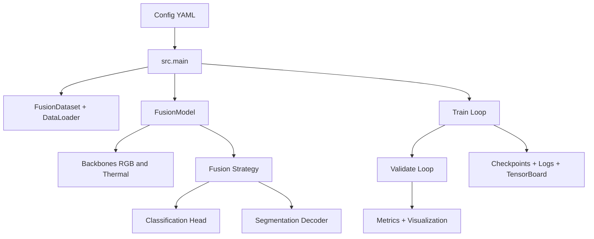
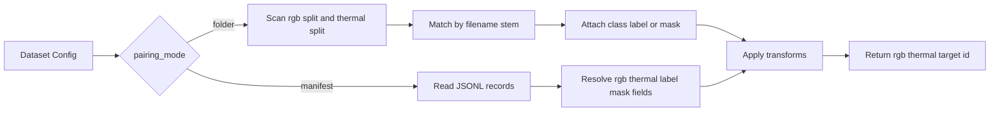
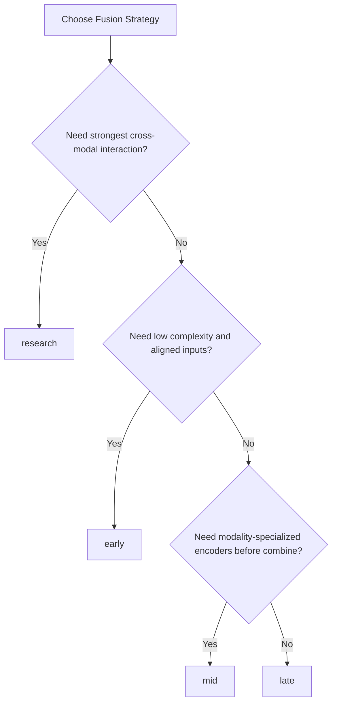
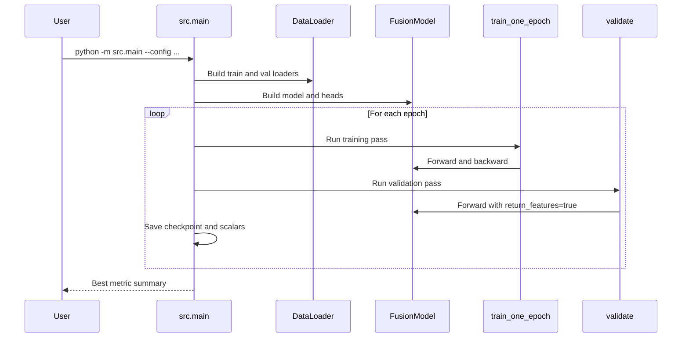
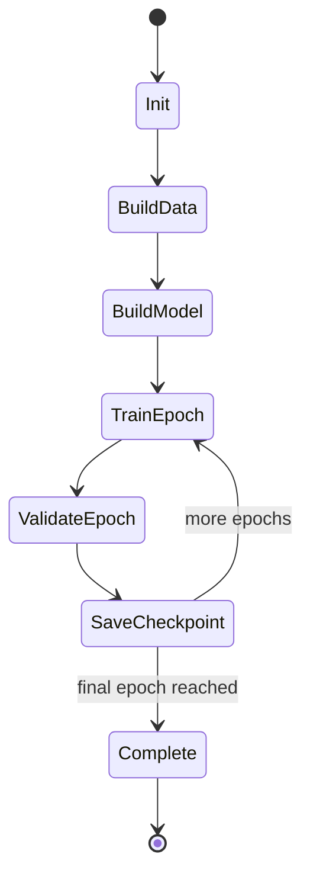

# RGB-T Fusion


RGB-T Fusion is a modular training framework for multimodal computer vision experiments that combine visible-spectrum RGB imagery with thermal imagery. The project is designed to make research iteration fast while staying practical for real GPU training workflows. It gives you one configurable entrypoint and multiple fusion strategies, so you can compare methods with minimal code changes and clear experiment outputs.

The codebase supports both classification and semantic segmentation under the same architecture envelope. This is useful because many multimodal projects need to evaluate representation quality across different downstream tasks, not just one benchmark metric.

> [!IMPORTANT]
> This repository is a research baseline and extension platform. It is intentionally structured for experimentation, reproducibility through YAML configuration, and rapid fusion-module iteration.

## Table Of Contents

- [Project Overview](#project-overview)
- [Why RGB-T Is Needed](#why-rgb-t-is-needed)
- [Tech Stack](#tech-stack)
- [Architecture](#architecture)
- [Data Model And Pairing](#data-model-and-pairing)
- [Fusion Strategy Guide](#fusion-strategy-guide)
- [Training Lifecycle](#training-lifecycle)
- [Configuration Reference](#configuration-reference)
- [Experiment Profiles](#experiment-profiles)
- [Metric Semantics](#metric-semantics)
- [Runbook](#runbook)
- [Output Artifacts](#output-artifacts)
- [Troubleshooting Tips](#troubleshooting-tips)
- [Roadmap Next Steps](#roadmap-next-steps)
- [Collapsible API Reference](#collapsible-api-reference)
- [Repository Layout](#repository-layout)

## Project Overview

This framework wraps dataset loading, multimodal model construction, training, validation, metrics, visualization, checkpointing, and optional TensorBoard logging into a single command-line workflow. It is built to reduce setup friction when you need to compare early, mid, late, and research-oriented fusion methods on aligned RGB-T data.

The primary design goal is not just model training. The goal is to create a controlled environment where changes to fusion behavior are easy to isolate, benchmark, and debug.

| # | Dimension | What It Is | Why It Matters | Where To See It |
| --- | --- | --- | --- | --- |
| 1 | Core Purpose | Multimodal RGB + Thermal research framework | Provides a baseline for robust low-light and adverse-condition perception | src/main.py, src/models/fusion_model.py |
| 2 | Supported Tasks | Classification and semantic segmentation | Allows shared backbone/fusion experimentation across task families | configs/*.yaml and src/training/* |
| 3 | Fusion Modes | Early, mid, late, and research (MMTM-style) | Makes comparative ablation straightforward from config only | src/models/fusion/ and src/models/fusion_model.py |
| 4 | Execution Model | Single Python module entrypoint with YAML controls | Keeps experiment execution reproducible and scriptable | python -m src.main --config ... |
| 5 | Observability | Logs, checkpoints, visualizations, optional TensorBoard | Improves training traceability and debugging quality | runs/&lt;exp&gt;/train.log, viz/, tb/ |

> [!NOTE]
> This table summarizes the baseline contract of the repository: what the framework is, what it does, and where each capability is implemented.

## Why RGB-T Is Needed

RGB imagery carries rich texture and color details in well-lit conditions, but it can fail in darkness, fog, glare, and other hard environments. Thermal imagery provides complementary signal that is less dependent on visible illumination and can stabilize perception when RGB alone degrades.

Using both modalities can reduce blind spots and improve reliability. In practice, the effectiveness depends on how and where features are fused, which is why this project exposes multiple fusion pathways instead of locking you to one design.

> [!TIP]
> Start with mid fusion when exploring a new dataset. It often offers a strong balance between modality specialization and shared representation quality.

## Tech Stack

The stack centers on PyTorch for model execution, DataLoader orchestration, AMP support, and optimizer/scheduler workflows. Supporting dependencies cover image IO, data transforms, metrics, plotting, progress bars, and config parsing.

| # | Layer | Primary Tools | What They Do | Why They Are Needed |
| --- | --- | --- | --- | --- |
| 1 | Modeling | torch, torchvision | Backbones, fusion modules, decoder heads | Core deep learning execution and pretrained model support |
| 2 | Optimization | AdamW, schedulers | Gradient updates and LR policy | Stable convergence across classification and segmentation |
| 3 | Mixed Precision | torch.autocast, torch.amp.GradScaler | Automatic FP16 region execution on CUDA | Improves throughput and memory efficiency on GPU |
| 4 | Data Handling | Pillow, DataLoader, custom dataset | RGB-T pair loading and target formation | Enables folder and manifest pairing modes |
| 5 | Utilities | PyYAML, tqdm, matplotlib, tensorboard | Config parsing, progress display, visualization, logging | Makes experiments inspectable and reproducible |

> [!NOTE]
> This table explains the operational stack, not just package names. Each row maps directly to a functional responsibility in the training pipeline.

## Architecture

The architecture is intentionally modular. Dataset and transforms produce normalized paired tensors, the model layer performs modality encoding and fusion, and the training layer handles optimization and validation while the utility layer captures logs, metrics, and visuals.



> [!NOTE]
> This diagram shows control flow from configuration through model execution to artifact generation.

| # | Architectural Layer | What It Owns | Input | Output |
| --- | --- | --- | --- | --- |
| 1 | Config Layer | Experiment parameters and runtime flags | YAML file | In-memory config dictionary |
| 2 | Data Layer | RGB-T pair loading and target generation | Folders or manifest JSONL | Batched tensors and targets |
| 3 | Model Layer | Backbones, fusion blocks, task heads | RGB + thermal tensors | Logits and optional features |
| 4 | Training Layer | Optimization, scaling, scheduler, checkpoints | Model outputs and targets | Updated weights and metrics |
| 5 | Observability Layer | Logging, validation visuals, TB traces | Epoch stats and sample outputs | Train logs, viz PNGs, scalar dashboards |

> [!NOTE]
> This table clarifies separation of concerns so extensions can be added in the right layer without cross-cutting side effects.

## Data Model And Pairing

Two pairing modes are supported. Folder mode pairs RGB and thermal images by stem name inside split folders. Manifest mode reads explicit JSONL records for fully custom layouts and is useful when data paths, labels, or masks are not derivable by naming conventions.



> [!NOTE]
> This flow illustrates how both pairing strategies converge into a common training sample schema.

| # | Pairing Mode | How It Works | When To Use | Required Fields |
| --- | --- | --- | --- | --- |
| 1 | folder | Pairs files by shared stem under split folders | Standard KAIST/LLVIP-like dataset layouts | root, split, rgb_dir, thermal_dir and labels_file or mask_dir by task |
| 2 | manifest | Reads JSONL rows with explicit modal paths and targets | Custom datasets with irregular naming or routing | manifest_file with rgb and thermal plus label or mask |
| 3 | classification target | Uses CSV id,label in folder mode or label in manifest row | Image-level recognition experiments | Numeric class label per sample |
| 4 | segmentation target | Loads mask PNG from mask_dir or manifest mask field | Dense per-pixel prediction experiments | Mask image aligned to RGB dimensions |
| 5 | sample id | Derived from RGB stem and returned in each sample dict | Tracking and debugging mismatches | File stem of rgb_path |

> [!NOTE]
> This table compares pairing behavior and target requirements so dataset onboarding is predictable.

## Fusion Strategy Guide

Fusion location changes the information bottleneck and therefore changes model behavior. Early fusion prioritizes lightweight integration, mid fusion emphasizes feature interaction, late fusion keeps modality decisions independent longer, and research fusion introduces channel recalibration interactions inspired by MMTM.



> [!NOTE]
> This decision aid helps pick an initial strategy before running systematic ablation experiments.

| # | Strategy | Fusion Stage | Strength | Tradeoff |
| --- | --- | --- | --- | --- |
| 1 | early | Input-level before shared encoder | Simple pipeline and low overhead | Can underuse modality-specific representation depth |
| 2 | mid | Feature-level after separate encoders | Strong default balance for many datasets | Slightly higher memory and compute cost |
| 3 | late | Decision-level blending for classification | Keeps branches independent until logits | Limited deep feature interaction |
| 4 | research | Cross-modal recalibration block at feature stage | Richer interaction and good research flexibility | Higher complexity and extra tuning sensitivity |
| 5 | segmentation fallback for late | Average of branch features in current implementation | Keeps segmentation path operational | Not equivalent to classification late-fusion logits path |

> [!NOTE]
> This strategy matrix combines design intent with practical constraints from the current implementation.

## Training Lifecycle

The runtime starts from CLI argument parsing and config load, then builds datasets, dataloaders, model, optimizer, scheduler, and AMP scaler. Each epoch performs training and validation, writes logs and artifacts, and updates latest and best checkpoints.



> [!NOTE]
> The sequence shows the exact orchestration order in the current training entrypoint.

| # | Config Block | Key Fields | Effect On Runtime | Example Values |
| --- | --- | --- | --- | --- |
| 1 | experiment | name, output_dir, seed | Controls run identity, artifacts, and deterministic setup | cls_research_resnet18, runs/..., 42 |
| 2 | task | name, num_classes, ignore_index | Selects criterion and metric path | classification or segmentation |
| 3 | dataset | train/val roots, dirs, image_size, pairing mode | Defines sample build and tensor dimensions | folder pairing with 256x256 or 320x320 |
| 4 | model | backbone, fusion_strategy, pretrained | Creates encoder and fusion graph | resnet18 + research |
| 5 | training | epochs, batch_size, lr, amp, workers | Defines optimization behavior and throughput | epochs 20-50, amp true |

> [!NOTE]
> This table is a fast map from YAML structure to runtime behavior.

## Configuration Reference

Configuration is the primary control surface of this framework. You should treat each YAML file as an executable experiment description: it defines the task, model family, fusion method, optimization policy, and runtime IO endpoints.

Use this section to reason about what a parameter changes before launching long training runs.

> [!TIP]
> Keep one baseline config unchanged and branch new files for experiments. This makes regressions easier to detect and keeps result interpretation clean.

### Internal Config Links

- [classification_early.yaml](configs/classification_early.yaml)
- [classification_research.yaml](configs/classification_research.yaml)
- [segmentation_mid.yaml](configs/segmentation_mid.yaml)
- [segmentation_research.yaml](configs/segmentation_research.yaml)

## Experiment Profiles

The repository already includes four starter experiment profiles that are intentionally different in task type, fusion method, and optimization settings. This gives you a built-in mini benchmark suite for fast smoke tests and first-pass strategy comparisons.

Each profile can be treated as a reproducible baseline. Rather than rewriting one config repeatedly, clone one file per hypothesis so that every run remains auditable.

| # | Config File | Task | Backbone | Fusion | Resolution | Epochs | Batch Size | LR | Scheduler |
| --- | --- | --- | --- | --- | --- | --- | --- | --- | --- |
| 1 | configs/classification_early.yaml | classification | resnet18 | early | 256x256 | 20 | 16 | 3e-4 | cosine |
| 2 | configs/classification_research.yaml | classification | resnet18 | research | 256x256 | 30 | 12 | 2e-4 | cosine |
| 3 | configs/segmentation_mid.yaml | segmentation | mobilenet_v3_small | mid | 320x320 | 40 | 8 | 5e-4 | poly |
| 4 | configs/segmentation_research.yaml | segmentation | resnet18 | research | 320x320 | 50 | 6 | 3e-4 | poly |

> [!NOTE]
> This table is a compact run planning view. It helps decide which profile is suitable for quick debug runs versus longer research-grade training.

## Metric Semantics

Metrics are task-aware and are selected from the same runtime depending on the task block in config. This avoids maintaining separate codepaths while still producing meaningful evaluation outputs for each prediction problem.

When interpreting results, compare metrics only within the same task family. Classification accuracy and segmentation mIoU represent different error surfaces and cannot be directly compared as if they measure the same objective.

| # | Task | Primary Metric | Computation Surface | Best Direction | Implementation Source |
| --- | --- | --- | --- | --- | --- |
| 1 | classification | accuracy | sample-level class prediction | higher is better | src/utils/metrics.py (ClassificationMetrics) |
| 2 | segmentation | mIoU | pixel-level class overlap by confusion matrix | higher is better | src/utils/metrics.py (MeanIoU) |
| 3 | both | validation loss | criterion over model logits and targets | lower is better | src/training/validate.py |
| 4 | both | training loss | batch-averaged criterion during optimization | lower is better | src/training/train.py |
| 5 | run selection | best_metric | accuracy for cls, mIoU for seg | higher is better | src/main.py checkpoint logic |

> [!IMPORTANT]
> Best checkpoint selection is task-dependent by design. The training loop automatically chooses accuracy for classification and mIoU for segmentation.

## Runbook

The following commands are direct entry points that map to the existing scripts and modules in the repository. They are intentionally minimal and can be wrapped by your own orchestration tools.

| # | Goal | Command | What It Does | When To Use |
| --- | --- | --- | --- | --- |
| 1 | Install deps (pip) | pip install -r requirements.txt | Installs runtime and training dependencies | Quick Python environment setup |
| 2 | Create conda env | conda env create -f environment.yml | Builds pinned environment with CUDA channel choices | Reproducible environment provisioning |
| 3 | Run classification | python -m src.main --config configs/classification_research.yaml | Launches classification training with research fusion | Baseline comparison or ablation start |
| 4 | Run segmentation | python -m src.main --config configs/segmentation_mid.yaml | Launches segmentation training with mid fusion | Dense prediction experiments |
| 5 | Resume training | python -m src.main --config ... --resume runs/.../checkpoint_latest.pt | Restores model, optimizer, scaler, and epoch state | Interrupted jobs or long multi-day runs |

> [!NOTE]
> This runbook table ties each command to operational intent so execution is less trial-and-error.

## Output Artifacts

Each run writes a predictable artifact set under the configured output directory. Keeping these files consistent is important for experiment auditing and reproducibility.

| # | Artifact | Location Pattern | Produced By | What You Learn From It |
| --- | --- | --- | --- | --- |
| 1 | Training log | runs/&lt;exp&gt;/train.log | Logger utility | Epoch-level losses and key metric summaries |
| 2 | Latest checkpoint | runs/&lt;exp&gt;/checkpoint_latest.pt | save_checkpoint in main loop | Recovery point for resume workflows |
| 3 | Best checkpoint | runs/&lt;exp&gt;/checkpoint_best.pt | Best-metric branch in main loop | Candidate model for evaluation/export |
| 4 | Visualization image | runs/&lt;exp&gt;/viz/epoch_XXX.png | validate + visualization utility | Quick qualitative sanity checks each epoch |
| 5 | TensorBoard scalars | runs/&lt;exp&gt;/tb/ | SummaryWriter when enabled | Loss, metric, and LR trends over time |

> [!NOTE]
> This table defines the expected run footprint so missing artifacts are immediately diagnosable.

## Troubleshooting Tips

Training failures in multimodal pipelines usually come from path mismatches, shape mismatches, or target formatting issues rather than optimizer bugs. Start from data integrity checks, then verify config consistency, then inspect model/task compatibility.

> [!WARNING]
> If thermal and RGB image stems do not align in folder pairing mode, samples are silently skipped from pairing. This can reduce effective dataset size and distort metrics.

| # | Symptom | Likely Cause | How To Fix | Prevention Tip |
| --- | --- | --- | --- | --- |
| 1 | RuntimeError missing class label | labels CSV missing id row | Ensure id matches RGB stem exactly | Validate CSV keys before training |
| 2 | RuntimeError missing segmentation mask | mask file absent for sample | Add missing mask or remove sample from split | Run preflight file count checks by split |
| 3 | CUDA OOM | Batch size and resolution too high | Lower batch_size or image_size, keep amp enabled | Scale workload gradually from a small debug run |
| 4 | No multi-GPU speedup | Single visible GPU or disabled flag | Check CUDA visibility and multi_gpu.enabled | Print torch.cuda.device_count before launch |
| 5 | Poor validation metric trend | Fusion mode-task mismatch or noisy labels | Switch strategy and verify target quality | Track qualitative viz images every epoch |

> [!NOTE]
> This troubleshooting table focuses on high-frequency failure modes observed in RGB-T workflows.

## Roadmap Next Steps

The framework is already usable for baseline experiments, but the highest-impact upgrades are related to distributed training, richer evaluation outputs, and stronger reproducibility reporting.

Use this list as an implementation queue when deciding what to build next.

- [ ] Add DistributedDataParallel launch path and rank-aware logging in src/main.py.
- [ ] Add evaluation-only mode with checkpoint loading and no optimizer state creation.
- [ ] Add per-class IoU export and confusion matrix image generation for segmentation runs.
- [ ] Add simple benchmark script for running all four shipped configs and collecting summary metrics.
- [ ] Add CI workflow for lint and basic import checks.

> [!TIP]
> If you need one immediate coding priority, start with evaluation-only mode. It shortens iteration cycles and improves experiment triage without changing training behavior.

## Runtime State View

The state machine below describes how the trainer transitions between setup, iterative epochs, checkpointing, and completion.



> [!NOTE]
> This state diagram is useful for understanding where to instrument additional logging or callbacks.

## Collapsible API Reference

<details>
<summary><strong>Open API and module reference</strong></summary>

### Entry Point

- src/main.py
  - set_seed(seed): seeds Python, NumPy, and torch RNG streams for reproducibility.
  - build_criterion(cfg): chooses loss by task, with ignore_index support for segmentation.
  - maybe_wrap_multi_gpu(model, cfg): applies DataParallel when enabled and multiple CUDA devices are available.
  - save_checkpoint(...): writes latest and optional best checkpoint files.
  - load_checkpoint(...): restores model, optimizer, and scaler states.
  - main(): orchestrates config load, data/model build, training loop, validation, and artifact logging.

### Data Layer

- src/data/fusion_dataset.py
  - FusionDataset: handles folder-mode and manifest-mode sample construction.
  - __getitem__: returns rgb, thermal, target, and id fields; enforces label/mask presence by task.

### Model Layer

- src/models/fusion_model.py
  - FusionModel: shared multimodal wrapper selecting strategy-specific behavior.
  - SegmentationDecoder: lightweight decoder head with bilinear upsampling to input resolution.

### Training Layer

- src/training/train.py
  - train_one_epoch(...): training pass with optional AMP and gradient clipping.

- src/training/validate.py
  - validate(...): validation pass with metrics and per-epoch visualization export.

### Utility Layer

- src/utils/config.py
  - load_config(path): YAML parser with safety checks.
  - parse_args(): CLI argument surface for config, resume, and device.

- src/utils/logger.py
  - build_logger(output_dir): stream and file logging setup.

- src/utils/metrics.py
  - ClassificationMetrics and MeanIoU implementations.

- src/utils/visualization.py
  - save_fusion_visualization(...): exports four-panel visual summaries per epoch.

### API Navigation Links

- [src/main.py](src/main.py)
- [src/data/fusion_dataset.py](src/data/fusion_dataset.py)
- [src/models/fusion_model.py](src/models/fusion_model.py)
- [src/training/train.py](src/training/train.py)
- [src/training/validate.py](src/training/validate.py)
- [src/utils/config.py](src/utils/config.py)
- [src/utils/logger.py](src/utils/logger.py)
- [src/utils/metrics.py](src/utils/metrics.py)
- [src/utils/visualization.py](src/utils/visualization.py)

</details>

> [!IMPORTANT]
> The API reference above reflects the current codebase entrypoints and utility surfaces. If you add modules, keep this section synchronized to avoid documentation drift.

## Repository Layout

The structure below is organized so data, models, training logic, and utilities stay isolated. This reduces coupling and makes it easier to swap components during experiments.

```text
configs/
data/
docker/
docs/
notebooks/
scripts/
src/
  data/
  models/
    backbones/
    fusion/
  training/
  utils/
```

> [!CAUTION]
> Keep experiment outputs under runs/ and keep dataset paths externalized in configs. Hardcoded local paths are one of the most common causes of non-reproducible training.

## Quick Start Checklist

- [ ] Prepare paired RGB and thermal inputs for train and val splits.
- [ ] Ensure classification labels or segmentation masks exist for every sample.
- [ ] Choose one starter config from configs/.
- [ ] Run a short debug training and inspect viz outputs.
- [ ] Scale batch size and epochs after sanity checks pass.

This checklist is intentionally short so you can validate data integrity before spending GPU time on long runs.
